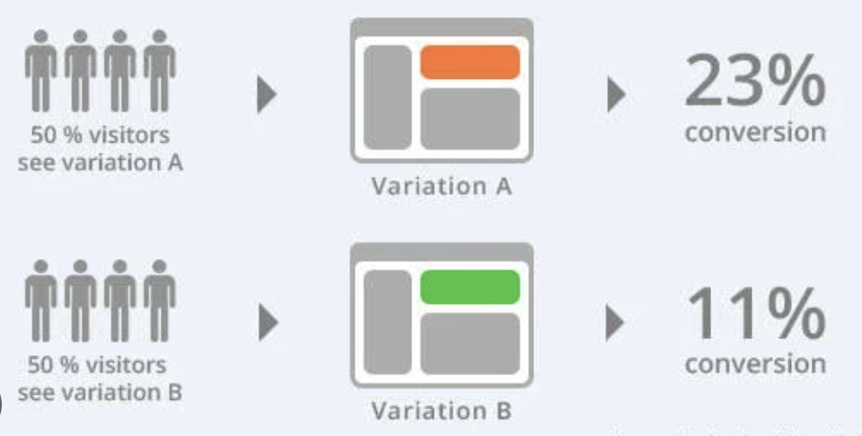

## 실전프로젝트 6가지 Portfolio
------------------------------------------------------------------------

### [실전프로젝트1] 당신이 UN 사무국의 세계행복보고서 담당자라면? 

---
### [실전프로젝트2] 세대간 갈등이 우리 조직에 문제가 됩니까? 
---
### [실전프로젝트3] 광고비 절감과 전환율 극대화를 위한 A/B테스팅 
---
### [실전프로젝트4] 유학 컨설턴트가 되어 해외 대학 지원자 합격률 높이기 
---
### [실전프로젝트5] 유학 컨설턴트가 되어 해외 대학 합격 예측 모델 만들기 
---
### [실전프로젝트6] 대규모 설문조사 서술형 응답 분석 

<!-- 
[Project 3 Title](http://example.com/) 

------------------------------------------------------------------------

### Category Name 2

-   [Project 1 Title](http://example.com/)
-   [Project 2 Title](http://example.com/)
-   [Project 3 Title](http://example.com/)
-   [Project 4 Title](http://example.com/)
-   [Project 5 Title](http://example.com/) -->

------------------------------------------------------------------------

------------------------------------------------------------------------

Page template forked from <a href="https://github.com/evanca/quick-portfolio">evanca</a>

<!-- Remove above link if you don't want to attibute -->
